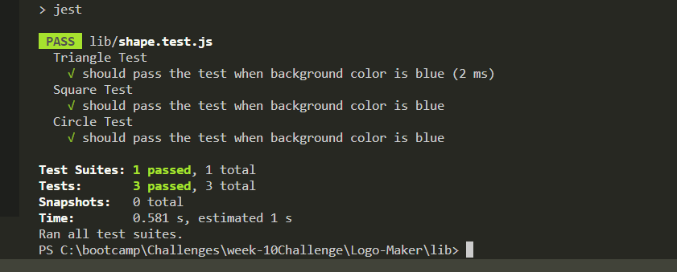
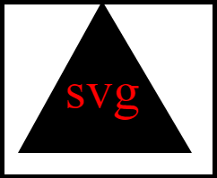
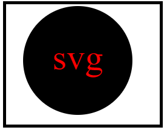
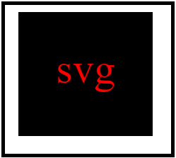

# Logo-Maker

```
The link for my deployed wesite can viewed here
https://shiby-mathew.github.io/Logo-Maker/

```

## Description

```
This appliction generates a logo and save that in .svg format using user's input. This application built in Node.js and takes user input from command-line.The application prompts the user to select a color and a shape, provide text for the logo, and save the generated SVG to a `.svg` file.

```

### User Story

```

AS a freelance web developer
I WANT to generate a simple logo for my projects
SO THAT I don't have to pay a graphic designer

```

## Acceptance Criteria

```md
GIVEN a command-line application that accepts user input
WHEN I am prompted for text
THEN I can enter up to three characters
WHEN I am prompted for the text color
THEN I can enter a color keyword (OR a hexadecimal number)
WHEN I am prompted for a shape
THEN I am presented with a list of shapes to choose from: circle, triangle, and square
WHEN I am prompted for the shape's color
THEN I can enter a color keyword (OR a hexadecimal number)
WHEN I have entered input for all the prompts
THEN an SVG file is created named `logo.svg`
AND the output text "Generated logo.svg" is printed in the command line
WHEN I open the `logo.svg` file in a browser
THEN I am shown a 300x200 pixel image that matches the criteria I entered
```

## Technologies Used

```
Node.js
Inquirer@8.2.4
Jest for unit testing
```

## Usage

- Create SVG logo using user input
- Multiple prompts asking user for text, text-color, shape and shape color
- Once logo is created that will save in .svg format and saved in a file

## Unit Test Screen shot



## Screen Shots of SVG logo





## Video Link

[](https://drive.google.com/file/d/10Vm7-G4cCCljKqmavsAovbO8f1UWnTEk/view)

### Resources

- [Example SVG](https://static.fullstack-bootcamp.com/fullstack-ground/module-10/circle.svg)

- [Scalable Vector Graphics (SVG)](https://en.wikipedia.org/wiki/Scalable_Vector_Graphics)

- [SVG tutorial](https://developer.mozilla.org/en-US/docs/Web/SVG/Tutorial)

- [Basic SVG shapes](https://developer.mozilla.org/en-US/docs/Web/SVG/Tutorial/Basic_Shapes)

- [Text in SVG](https://developer.mozilla.org/en-US/docs/Web/SVG/Tutorial/Texts)

- [SVG VS Code extension](https://marketplace.visualstudio.com/items?itemName=jock.svg)
